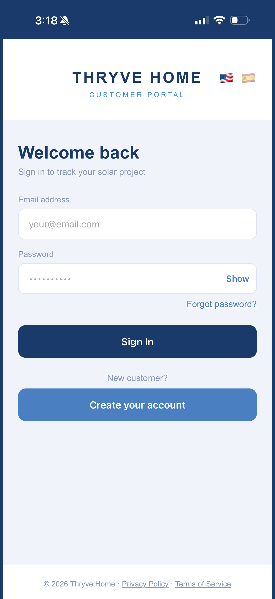
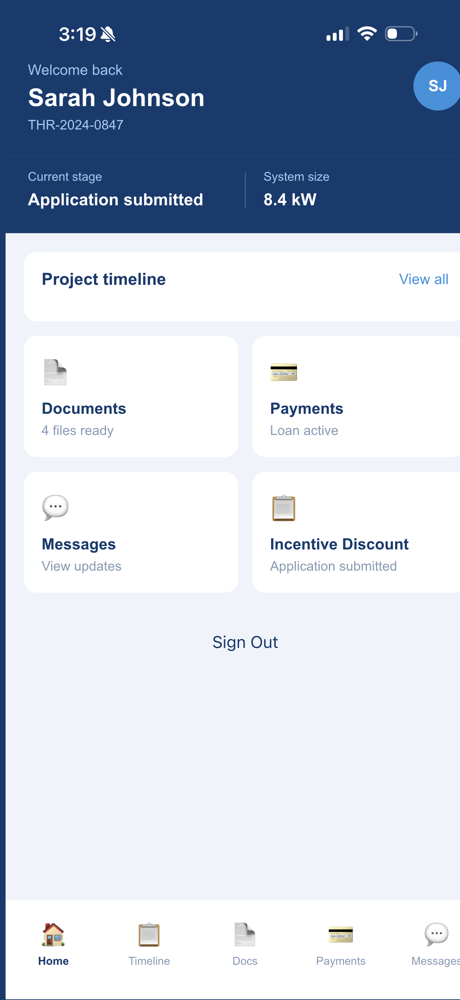
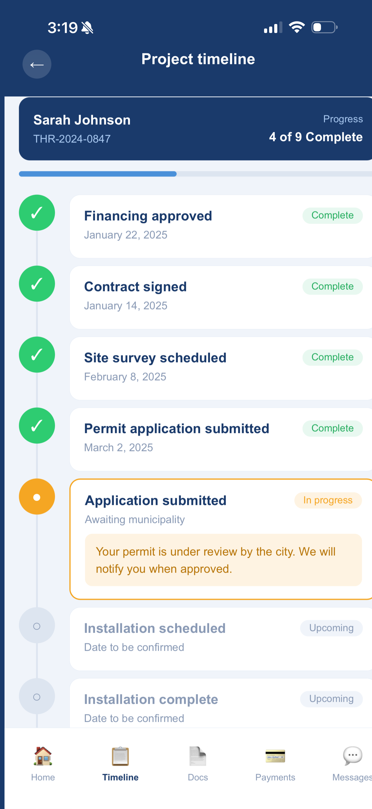
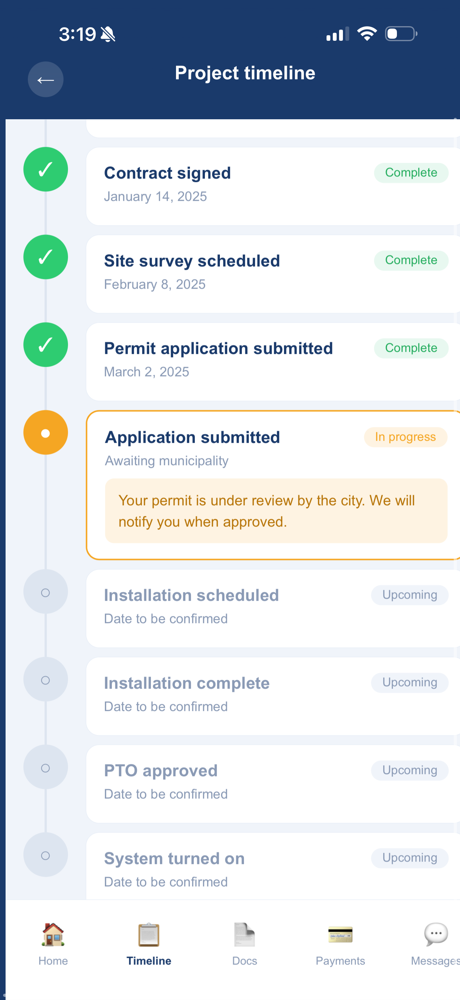
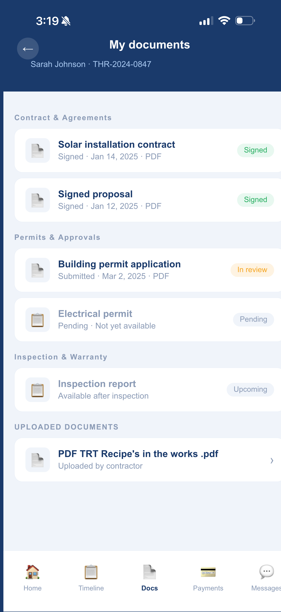
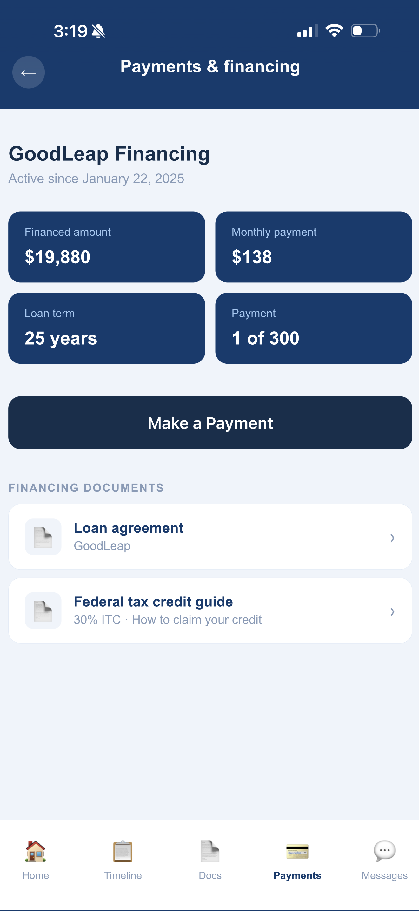
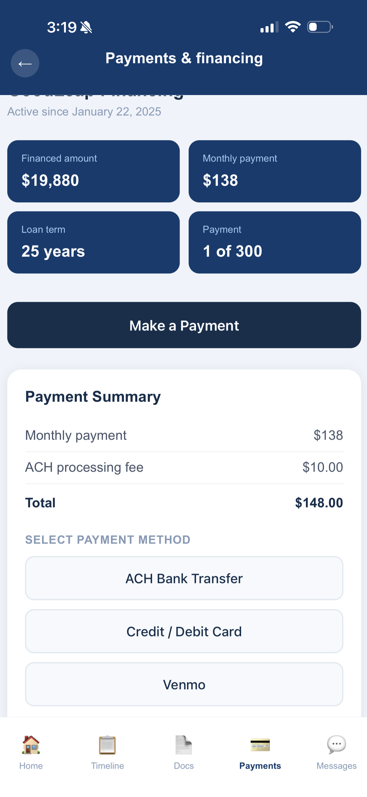
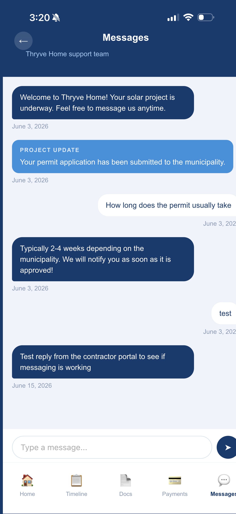
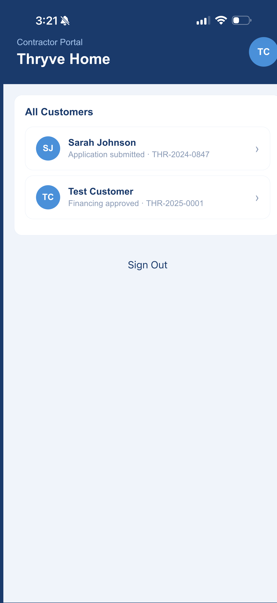
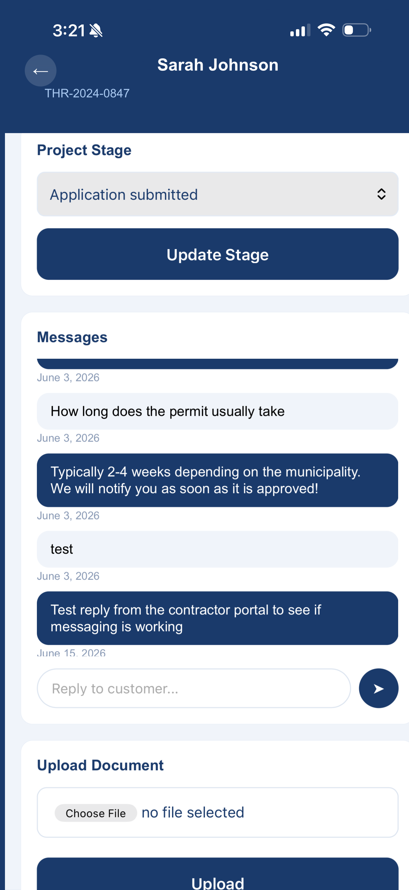

# Thryve Home — Solar Customer Portal

A full-stack web application built for a solar installation company. 
Thryve Home gives customers a real-time window into their solar project 
— from financing approval to system activation — while giving contractors 
a portal to manage documents, update project stages, and communicate with customers.

## Live Demo

🔗 [thryve-v2.netlify.app](https://thryve-v2.netlify.app)

**Customer login:** sarah@test.com / Thryve2025!  
**Contractor login:** contractor@test.com / Thryve2025!

## Screenshots

### Customer Portal

### Contractor Portal

## Features

### Customer Portal
- Secure login with email and password
- Dashboard showing current project stage and system size
- 9-stage project timeline with real-time progress tracking
- Document viewer for contracts, permits, and inspection reports
- Payments and financing overview with payment flow
- In-app messaging with the Thryve support team
- Incentive discount screen
- Full English / Spanish language toggle with persistent preference
- New customer registration linked to project number

### Contractor Portal
- Role-based login — contractors see a different dashboard than customers
- View all customers and their current project stages
- Update customer project stages in real time
- Upload documents directly to customer accounts
- Reply to customer messages

## Tech Stack

- **Frontend:** HTML, CSS, JavaScript
- **Backend/Database:** Supabase (PostgreSQL, Authentication, Storage)
- **Deployment:** Netlify
- **Version Control:** Git / GitHub

## Project Background

This app was built as a client project for a solar installation company. 
It is a single-page application with role-based authentication, 
a bilingual interface, and real-time data from a cloud database. 
Built from scratch over several months while simultaneously learning 
web development through The Odin Project and freeCodeCamp.

## Author

Steven Hullings  
[GitHub](https://github.com/StevenH1974)
